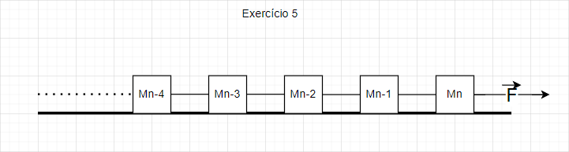

# Trabalho de Fisica - 2023 - Semestre 1

## Exercício 1

### Variáveis: (Massa 1, Massa 2, Massa 3, Atrito, Força)
### Retorno: (Aceleração, Tensão 1, Tensão 2, Tensão 3)

## Exercício 2

### Variáveis: (Massa 1, Massa 2, Atrito, Gravidade)
### Retorno: (Aceleração, Tensão)

## Exercício 3

### Variáveis: (Massa 1, Massa 2, Gravidade)
### Retorno: (Aceleração, Tensão)

## Exercício 4

### Variáveis: (Massa 1, Massa 2, Ângulo, Gravidade)
### Retorno: (Aceleração, Tensão)

## Exercício 5

### Variáveis: (Número de Objetos, Razão da Progressão Aritmética, Massas definidas pela progressão, Força, Atrito)
### Retorno: (Aceleração, Tensão N)

## Exercício 6

### Variáveis: (Massa A, Massa B, Massa C, Atrito, Força)
### Retorno: (Aceleração, ForçaAB, ForçaBC)
